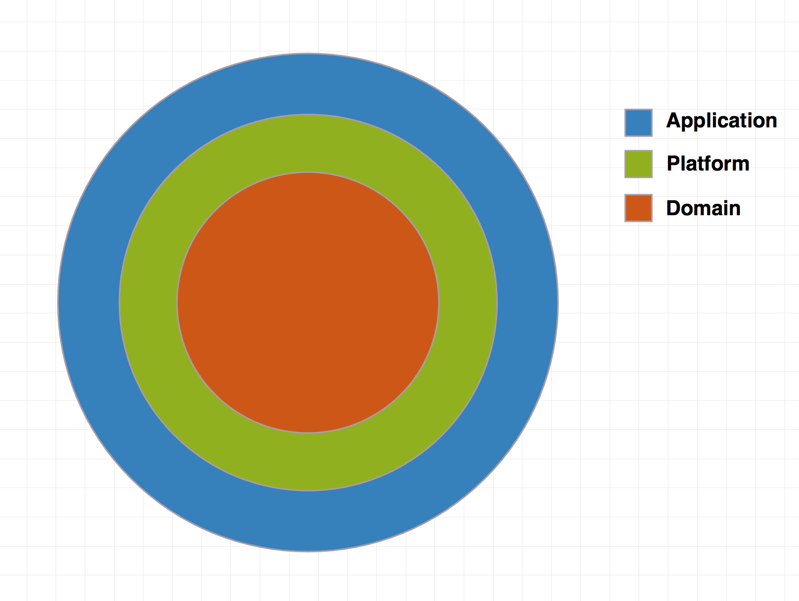

# Clean architecture with [RxSwift](https://github.com/ReactiveX/RxSwift)

### Installation

Dependencies in this project are provided via Cocoapods. Please install all dependecies with

`
pod install
`

## High level overview


#### Domain 


The `Domain` is basically what is your App about and what it can do (Entities, UseCase etc.) **It does not depend on UIKit or any persistence framework**, and it doesn't have implementations apart from entities

#### Platform

The `Platform` is a concrete implementation of the `Domain` in a specific platform like iOS. It does hide all implementation details. For example Database implementation whether it is CoreData, Realm, SQLite etc.

#### Application
`Application` is responsible for delivering information to the user and handling user input. It can be implemented with any delivery pattern e.g (MVVM, MVC, MVP). This is the place for your `UIView`s and `UIViewController`s. As you will see from the example app, `ViewControllers` are completely independent of the `Platform`.  The only responsibility of a view controller is to "bind" the UI to the Domain to make things happen. In fact, in the current example we are using the same view controller for Realm and CoreData.


## Detail overview

 
To enforce modularity, `Domain`, `Platform` and `Application` are separate targets in the App, which allows us to take advantage of the `internal` access layer in Swift to prevent exposing of types that we don't want to expose.

#### Domain

Entities are implemented as Swift value types

```swift
struct Card: Codable {
    let name: String
    let mobile: String
    let company: String
    let position: String
    let address: String
    let id: String
    let createdAt: Date
}
```

UseCases are protocols which do one specific thing:

```swift
protocol ICardUseCase {
    func cards() -> Observable<[Card]>
    func addNewCard(card: Card) -> Observable<Void>
}
```

`UseCaseProvider` is a [service locator](https://en.wikipedia.org/wiki/Service_locator_pattern).  In the current example, it helps to hide the concrete implementation of use cases.

#### Platform

In some cases, we can't use Swift structs for our domain objects because of DB framework requirements (e.g. CoreData, Realm). 


The `Platform` also contains concrete implementations of your use cases, repositories or any services that are defined in the `Domain`.

```swift
func cards() -> Observable<[Card]> {
    let realm = try! Realm()
    let cards = realm.objects(CardLocal.self).sorted(byKeyPath: "createdAt", ascending: false)
    return Observable<[Card]>.just(cards.toArray(ofType: CardLocal.self).map({ $0.toCard()})).asObservable()
}

func addNewCard(card: Card) -> Observable<Void> {
    let cardLocal = CardLocal(card: card)
    let realm = try! Realm()
    realm.safeWrite {
        realm.add(cardLocal, update: .all)
    }
    return Observable<Void>.just(())
}
```

As you can see, concrete implementations are internal, because we don't want to expose our dependecies. The only thing that is exposed in the current example from the `Platform` is a concrete implementation of the `UseCaseProvider`.

#### Application

In the current example, `Application` is implemented with the [MVVM](https://en.wikipedia.org/wiki/Model–view–viewmodel) pattern and heavy use of [RxSwift](https://github.com/ReactiveX/RxSwift), which makes binding very easy.


Where the `ViewModel` performs pure transformation of a user `Input` to the `Output`


A `ViewModel` can be injected into a `ViewController` via property injection or initializer. In the current example, this is done by `Navigator`.


### Links
* [RxSwift](https://github.com/ReactiveX/RxSwift)
* [RxSwift Book](https://store.raywenderlich.com/products/rxswift)
* [Robert C Martin - Clean Architecture and Design](https://www.youtube.com/watch?v=Nsjsiz2A9mg)
* [Cycle.js](https://cycle.js.org)
* [ViewModel](https://medium.com/@SergDort/viewmodel-in-rxswift-world-13d39faa2cf5#.qse37r6jw) in Rx world
* [Origin Article](https://github.com/sergdort/CleanArchitectureRxSwift)
